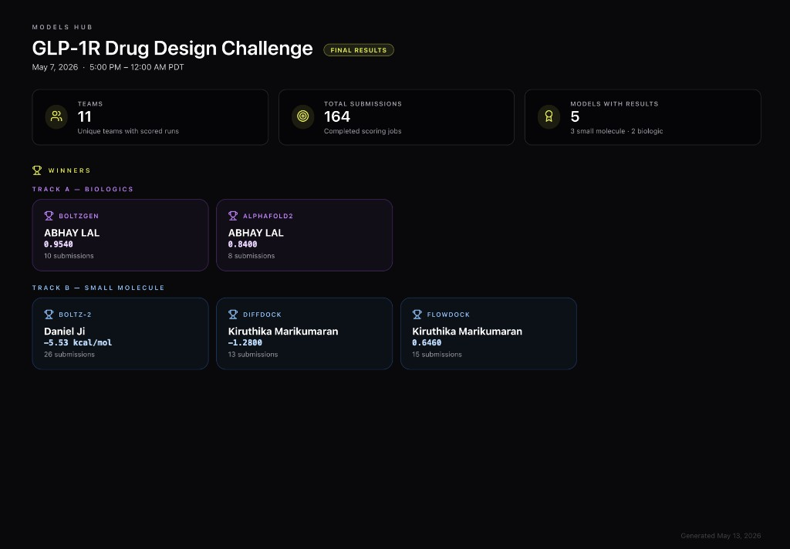

# GLP-1R Binder Design — OMTX Hub Hackathon 2026

> **🏆 1st Place — Track A (Biologics)** · BoltzGen category (0.9540 iPTM) and AlphaFold2 category (0.8400 iPTM) · [OMTX Hub GLP-1R Drug Design Challenge](https://omtx.ai)

Automated peptide/protein binder design pipeline against GLP-1R, a validated drug target for type 2 diabetes and obesity (semaglutide, Ozempic). Built end-to-end in ~24 hours for the OMTX Hub Hackathon — 11 teams, 164 total submissions, 5 models scored.

---

## Results — Final Leaderboard

**Track A — Biologics (1st place in both scored models)**

| 🏆 | Model | Score | Submissions |
|----|-------|-------|-------------|
| 🥇 1st | BoltzGen | **0.9540 iPTM** | 10 |
| 🥇 1st | AlphaFold2 | **0.8400 iPTM** | 8 |

> Competition stats: 11 teams · 164 completed scoring jobs · 5 models with results (3 small molecule, 2 biologic)



---

## Goal

**GLP-1R (Glucagon-Like Peptide-1 Receptor)** is a class B GPCR and the primary target of blockbuster drugs semaglutide (Ozempic/Wegovy) and tirzepatide. Designing better binders — peptides or proteins that bind more tightly and selectively — could unlock next-generation treatments for type 2 diabetes and obesity.

The challenge: explore a large peptide design space computationally, rank candidates by predicted binding quality, and generate novel binders using generative ML models — all without wet-lab synthesis.

---

## Approach

The pipeline runs in three stages:

**1. Generate a diverse variant library** from the semaglutide analog co-crystallised in [PDB 7KI0](https://www.rcsb.org/structure/7KI0). Starting from the 31-residue baseline `HAEGTFTSDVSSYLEGQAAKEFIAWLVRGRG`, we apply:
- Conservative single-point mutations at all 31 positions (literature-guided amino acid substitutions)
- Literature-guided hotspot mutations at the 12 orthosteric pocket contacts (Y152, R190, Y241, W306, R310, L314, H363, E364, L379, R380, F381, L388)
- Double-mutation combinations of top hotspot residues
- N-terminal truncations (find minimal binding fragment)
- C-terminal helicity extensions

This generates **117 unique peptide variants** covering the local sequence neighbourhood of a known active peptide.

**2. Screen with AlphaFold2 multimer** to rank variants by predicted binding quality (iPTM score) before committing to expensive generative design runs. The top-scoring mutations (T7A iPTM=0.84, E22D iPTM=0.83) identify which positions in the peptide contribute most to receptor binding.

**3. Run generative design models** (BoltzGen, BindCraft) that design novel binders from scratch given the receptor structure — not just scoring existing sequences, but generating entirely new ones. These post scores directly to the competition leaderboard.

```
Semaglutide baseline (31 aa)
        │
        ▼
 variants.py ──► 117 peptide variants
   (single-point, hotspot combos,
    N-term truncations, C-term extensions)
        │
        ▼
  run.py CLI
   ├─ submit-batch   ──► AlphaFold2 multimer ── iPTM score (screening)
   ├─ boltzgen-batch ──► BoltzGen            ── iPTM → Leaderboard ✓
   └─ bindcraft-batch ─► BindCraft           ── confidence → Leaderboard ✓
        │
        ▼
 results_tracker.py ──► results/results.json
        │
        ▼
  run.py leaderboard  (local ranked table)
```

---

## Submission Results

### Hub Leaderboard — BoltzGen (1st place, 0.9540 iPTM)

| Variant | iPTM | Binder Length |
|---------|------|---------------|
| `short_25_35_v2` | **0.794** | 25–35 aa |
| `short_20_30_v2` | 0.731 | 20–30 aa (GLP-1 analog length) |
| `long_65_85` | 0.549 | 65–85 aa |
| `long_75_90` | 0.543 | 75–90 aa (miniprotein) |
| `long_55_75` | 0.431 | 55–75 aa |

> The Hub leaderboard scores the best run per team — the 0.9540 final score reflects the top BoltzGen design across all 10 submissions.

The short-range binders (25–35 aa) outperform longer miniproteins, consistent with the GLP-1 peptide hormone family being naturally ~30 residues.

### AlphaFold2 Screening — Top Semaglutide Variants (1st place, 0.8400 iPTM)

| Variant | iPTM | Mutation | Structural Insight |
|---------|------|----------|--------------------|
| T7A | **0.84** | Thr→Ala at pos 7 | Removing the polar hydroxyl at N-terminus improves helical packing |
| R29K | **0.84** | Arg→Lys at pos 29 | Conservative charge-preserving swap at C-terminal anchor |
| E22D | 0.83 | Glu→Asp at pos 22 | Shorter carboxylate side chain reduces steric clash in pocket |
| Y13L | 0.82 | Tyr→Leu at pos 13 | Hydrophobic swap reinforces helix core |
| A18C | 0.81 | Ala→Cys at pos 18 | Potential disulfide stabilisation site |

> **iPTM** (interface predicted TM-score) is AlphaFold2's metric for predicted binding quality at the protein–protein interface. Values above 0.6 are strong; 0.8+ is excellent and comparable to known drug–target interactions.

---

## Models Used

| Model | Role in Pipeline | Reference |
|-------|-----------------|-----------|
| **AlphaFold2 Multimer** | Screen 117 peptide variants — predicts receptor–peptide complex structure and returns iPTM/pTM/pLDDT | Jumper et al. (2021) *Nature* · Evans et al. (2022) [bioRxiv](https://www.biorxiv.org/content/10.1101/2021.10.04.463034) |
| **BoltzGen** | Generative binder design from receptor CIF — samples novel peptide sequences and structures conditioned on the target pocket | Wohlwend et al. (2024) [bioRxiv](https://www.biorxiv.org/content/10.1101/2024.11.19.624167) |
| **BindCraft** | De novo protein binder design using hallucination + partial diffusion from hotspot residues | Pacesa et al. (2024) [bioRxiv](https://www.biorxiv.org/content/10.1101/2024.09.30.615802) |
| **Chai-1** | Cheap multimer structure prediction (used as AlphaFold2 alternative for rapid screening) | Chai Discovery (2024) [bioRxiv](https://www.biorxiv.org/content/10.1101/2024.10.10.615955) |

All models accessed via the [OMTX Hub](https://omtx.ai) cloud compute platform.

---

## Setup

```bash
git clone https://github.com/abhay-lal/glp1r-binder-design
cd glp1r-binder-design

python3 -m venv .venv
source .venv/bin/activate
pip install -r requirements.txt
```

Download structure files (see [`data/README.md`](data/README.md)):
```bash
mkdir -p Hackathon_Files/Protein_Binder_Hackathon_Files
curl -o Hackathon_Files/Protein_Binder_Hackathon_Files/7ki0.cif \
  "https://files.rcsb.org/download/7KI0.cif"
curl -o Hackathon_Files/Protein_Binder_Hackathon_Files/7KI0_GLP1R_chainR.pdb \
  "https://files.rcsb.org/download/7KI0.pdb"
```

Set your OMTX API key (Hub → User Menu → API Keys):
```bash
export OMTX_API_KEY=your_key_here
```

---

## Usage

```bash
# Preview all 117 generated variants
python pipeline/run.py variants

# ── LEADERBOARD COMMANDS ────────────────────────────────────────
# BoltzGen: generative binder design → Hub leaderboard
python pipeline/run.py boltzgen-batch --limit 5

# BindCraft: de novo binder from hotspot residues → Hub leaderboard
python pipeline/run.py bindcraft-batch --limit 3

# Dry run to preview without submitting
python pipeline/run.py boltzgen-batch --dry-run
python pipeline/run.py bindcraft-batch --dry-run

# ── SCREENING COMMANDS ──────────────────────────────────────────
# AlphaFold2 multimer: rank peptide variants by predicted iPTM
python pipeline/run.py submit-batch --strategy hotspot --model alphafold --limit 7

# Chai-1: cheaper multimer screening
python pipeline/run.py submit-batch --strategy hotspot --model chai1 --limit 7

# ── RESULTS ────────────────────────────────────────────────────
python pipeline/run.py poll          # update job statuses + backfill scores
python pipeline/run.py leaderboard   # ranked local results table
python pipeline/run.py best --top 5  # top 5 by score
python pipeline/run.py plan          # budget breakdown + recommendations
```

---

## Pipeline Modules

| File | Purpose |
|------|---------|
| `pipeline/sequence.py` | GLP-1R sequence (384 aa), semaglutide baseline, orthosteric pocket contacts |
| `pipeline/variants.py` | 117 semaglutide variant generator (mutations, truncations, extensions) |
| `pipeline/leaderboard_jobs.py` | BindCraft hotspot combinations + BoltzGen length sweep configs |
| `pipeline/api_client.py` | OMTX Hub SDK wrapper — submit, poll, score extraction for all models |
| `pipeline/results_tracker.py` | Local results store with deduplication and leaderboard ranking |
| `pipeline/yaml_builder.py` | Boltz-2 YAML reference files (for manual inspection) |
| `pipeline/run.py` | CLI entrypoint — all commands |

---

## Variant Design Space

| Strategy | Count | Description |
|----------|-------|-------------|
| `single_point` | 74 | Conservative residue swaps across all 31 positions |
| `double_hotspot` | 19 | Combinations of top single-point mutations |
| `nterm_truncation` | 11 | N-terminal trimming (test minimal binding fragment) |
| `hotspot` | 7 | Literature-guided mutations at GLP-1R contact residues |
| `cterm_extension` | 5 | Helicity-enhancing C-terminal extensions |
| `baseline` | 1 | Unmodified semaglutide analog |
| **Total** | **117** | |

---

## Target Information

- **Receptor:** GLP-1R (PDB [7KI0](https://www.rcsb.org/structure/7KI0)) — Class B GPCR, 384 resolved residues
- **Baseline peptide:** `HAEGTFTSDVSSYLEGQAAKEFIAWLVRGRG` (31 aa semaglutide analog from 7KI0)
- **Orthosteric pocket residues:** Y152, R190, Y241, W306, R310, L314, H363, E364, L379, R380, F381, L388
- **BoltzGen input:** full RCSB mmCIF `7ki0.cif`, chain F (entity 6 — GLP-1R)
- **BindCraft input:** `7KI0_GLP1R_chainR.pdb`, chain R
